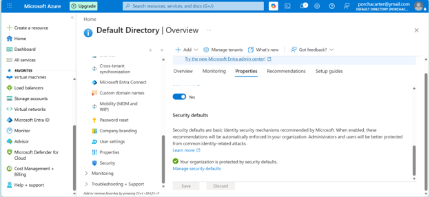

# Cloud Identity & Access Management (IAM) Security Lab

## Project Overview
This project demonstrates the deployment, organization, and perimeter hardening of a cloud-based identity environment using Microsoft Entra ID (formerly Azure Active Directory). In this lab, I established a structured corporate identity environment by building out a tiered departmental user framework and successfully deploying tenant-wide security guardrails to protect against identity-based attacks.

## Objectives
* Deployed a foundational enterprise directory structure containing 10 simulated corporate users divided across distinct departmental groups.
* Hardened the directory perimeter by evaluating identity security postures and enabling tenant-wide Multi-Factor Authentication (MFA).
* Mitigated credential-stuffing risks by restricting legacy authentication protocols.

## Technologies & Frameworks Used
* **Cloud Platform:** Microsoft Azure
* **Identity Management:** Microsoft Entra ID (Azure AD)
* **Security Controls:** Entra ID Security Defaults, Multi-Factor Authentication (MFA)

---

## Architectural & Security Implementation

### Phase 1: Directory Architecture & User Provisioning
To simulate a real-world enterprise environment, I provisionsed 10 individual user accounts within the directory. These users were segmented into functional organizational units (Groups) based on least-privilege principles to replicate standard corporate departments (e.g., IT, HR, Finance). This foundation ensures scalable access management and role-based access control (RBAC) readiness.

### Phase 2: Perimeter Hardening (Security Defaults)
To protect the newly created user ecosystem, I assessed the directory's security posture and implemented **Microsoft Security Defaults**. This administrative action automatically enforces modern security policies across the entire tenant:
1. **Mandatory MFA Registration:** Forces all users and administrators to register for multi-factor authentication, mitigating the risk of compromised passwords.
2. **Blocking Legacy Authentication:** Disables older protocols (like IMAP, POP3, and SMTP) that cannot handle modern MFA prompts, closing the primary loophole used in automated brute-force attacks.

---

## Verification & Visual Proof

The successful deployment of the tenant-wide security policy was verified directly within the Azure Portal properties interface:

*Figure 1: Microsoft Entra ID properties panel confirming that tenant-wide Security Defaults are active and the organization is protected.*

---

## Key Takeaways & SysAdmin Insights
* **Proactive Defense:** Enabling Security Defaults is one of the most impactful, cost-effective security measures a Systems Administrator can take to immediately secure a small-to-medium business infrastructure.
* **Identity as the Perimeter:** In modern cloud environments, identity is the primary security boundary. Properly structuring users and enforcing MFA is foundational to a Zero Trust security strategy.
